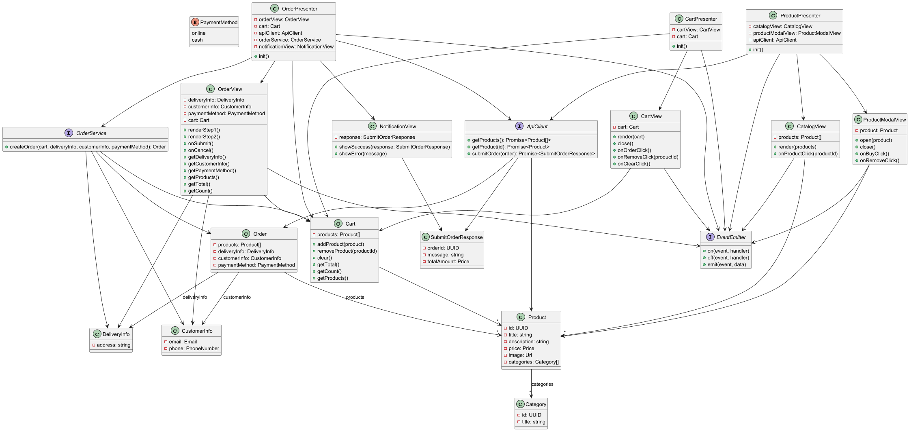

# Проектная работа "WEB-ларёк"

Стек: HTML, SCSS, TS, Webpack

Структура проекта:
- src/ — исходные файлы проекта
- src/components/ — папка с JS компонентами
- src/components/base/ — папка с базовым кодом

Важные файлы:
- src/pages/index.html — HTML-файл главной страницы
- src/types/index.ts — файл с типами
- src/index.ts — точка входа приложения
- src/scss/styles.scss — корневой файл стилей
- src/utils/constants.ts — файл с константами
- src/utils/utils.ts — файл с утилитами

## Установка и запуск
Для установки и запуска проекта необходимо выполнить команды

```
npm install
npm run start
```

или

```
yarn
yarn start
```
## Сборка

```
npm run build
```

или

```
yarn build
```


# Архитектура проекта "WEB-ларёк"

Данный документ описывает архитектуру клиентской части интернет-магазина "WEB-ларёк".  
Архитектура построена по паттерну **MVP (Model–View–Presenter)**.  
Взаимодействие между слоями реализовано через **событийно-ориентированный подход** с использованием `EventEmitter`.

---
# Архитектура по слоям

# СЛОЙ МОДЕЛЬ

## Класс `Cart`

**Назначение:**  
Представляет локальную корзину пользователя. Хранит список добавленных товаров, предоставляет методы управления корзиной и подсчёта общей стоимости.

**Конструктор:**
```ts
constructor() {}
```

**Поля:**
- `products: Product[]` — массив товаров, добавленных пользователем в корзину.

**Методы:**
- `addProduct(product: Product): void` — добавляет товар в корзину.
- `removeProduct(productId: UUID): void` — удаляет товар из корзины по ID.
- `clear(): void` — полностью очищает корзину.
- `getTotal(): Price` — возвращает сумму всех товаров.
- `getCount(): number` — возвращает общее количество.
- `getProducts(): Product[]` — возвращает список товаров.

---

## Интерфейс `Product`

**Назначение:**  
Товар из каталога.

**Поля:**
- `id: UUID`
- `title: string`
- `description: string`
- `price: Price`
- `image: Url`
- `categories: Category[]`

---

## Интерфейс `Category`

**Назначение:**  
Категория товара.

**Поля:**
- `id: UUID`
- `title: string`

---

## Интерфейс `CustomerInfo`

**Назначение:**  
Контактные данные клиента.

**Поля:**
- `email: Email`
- `phone: PhoneNumber`

---

## Интерфейс `DeliveryInfo`

**Назначение:**  
Адрес доставки.

**Поля:**
- `address: string`

---

## Интерфейс `SubmitOrderResponse`

**Назначение:**  
Ответ сервера при оформлении заказа.

**Поля:**
- `orderId: UUID`
- `message: string`
- `totalAmount: Price`

---

## Интерфейс `Order`

**Назначение:**  
Оформленный заказ.

**Поля:**
- `products: Product[]`
- `deliveryInfo: DeliveryInfo`
- `customerInfo: CustomerInfo`
- `paymentMethod: PaymentMethod`

---

# СЛОЙ ПРЕДСТАВЛЕНИЯ

## Интерфейс `CatalogView`

**Назначение:**  
Отображает каталог товаров.

**DOM-элементы:** контейнер, карточки

**Методы:**
- `render(products: Product[]): void`
- `onProductClick(productId: UUID): void`

---

## Интерфейс `ProductModalView`

**Назначение:**  
Модалка с товаром.

**DOM-элементы:** окно, кнопки "купить", "удалить", "закрыть"

**Методы:**
- `open(product: Product): void`
- `close(): void`
- `onBuyClick(): void`
- `onRemoveClick(): void`

---

## Интерфейс `CartView`

**Назначение:**  
Отображает содержимое корзины.

**DOM-элементы:** список товаров, кнопки "очистить", "оформить"

**Методы:**
- `render(cart: Cart): void`
- `onOrderClick(): void`
- `onRemoveClick(productId: UUID): void`
- `onClearClick(): void`
- `close(): void`

---

## Интерфейс `OrderView`

**Назначение:**  
Форма оформления заказа.

**DOM-элементы:** поля адреса, email, phone, оплата

**Методы:**
- `renderStep1(): void`
- `renderStep2(): void`
- `onSubmit(): void`
- `onCancel(): void`
- `getDeliveryInfo(): DeliveryInfo`
- `getCustomerInfo(): CustomerInfo`
- `getPaymentMethod(): PaymentMethod`
- `getProducts(): Product[]`
- `getTotal(): Price`
- `getCount(): number`

---

## Интерфейс `NotificationView`

**Назначение:**  
Показ результата отправки заказа.

**Методы:**
- `showSuccess(response: SubmitOrderResponse): void`
- `showError(message: string): void`
---

# СЛОЙ ПРЕЗЕНТЕРА

## Абстрактный класс `ProductPresenter`

**Назначение:**  
Управляет каталогом и модалкой товара.

**Конструктор:**
```ts
constructor(
  catalogView: CatalogView,
  productModalView: ProductModalView,
  apiClient: ApiClient,
  eventBus: EventEmitter
)
```

**Методы:**
- `init(): void` — подписка на события, загрузка каталога

---

## Абстрактный класс `CartPresenter`

**Назначение:**  
Управляет действиями с корзиной.

**Конструктор:**
```ts
constructor(
  cartView: CartView,
  cart: Cart,
  eventBus: EventEmitter
)
```

**Методы:**
- `init(): void` — подписка на buy/remove/clear

---

## Абстрактный класс `OrderPresenter`

**Назначение:**  
Обрабатывает оформление заказа.

**Конструктор:**
```ts
constructor(
  orderView: OrderView,
  cart: Cart,
  apiClient: ApiClient,
  orderService: OrderService,
  notificationView: NotificationView,
  eventBus: EventEmitter
)
```

**Методы:**
- `init(): void` — обработка submit

## Подписка на события
### Общий механизм:
Все `Presenter` и `View` взаимодействуют через `EventEmitter`.

### События

Список событий, передаваемых через `EventEmitter`. Используются для связи `View` и `Presenter`.

| Событие             | Payload               | Описание                    |
|---------------------|-----------------------|-----------------------------|
| `showProductCard`   | `Product`             | Открытие карточки товара    |
| `buy`               | `Product`             | Добавление товара в корзину |
| `showCart`          | —                     | Открытие корзины            |
| `remove`            | `UUID`                | Удаление товара из корзины  |
| `clear`             | —                     | Очистка всей корзины        |
| `order`             | —                     | Переход к оформлению заказа |
| `submit`            | —                     | Отправка заказа             |
| `showSubmitSuccess` | `SubmitOrderResponse` | Успешный заказ              |
| `showSubmitError`   | `string`              | Ошибка оформления           |

---
## UML Diagram

Ниже представлена UML-диаграмма, отражающая архитектуру модели проекта:

<details>
<summary>📂 Показать UML-схему</summary>

<br>



</details>